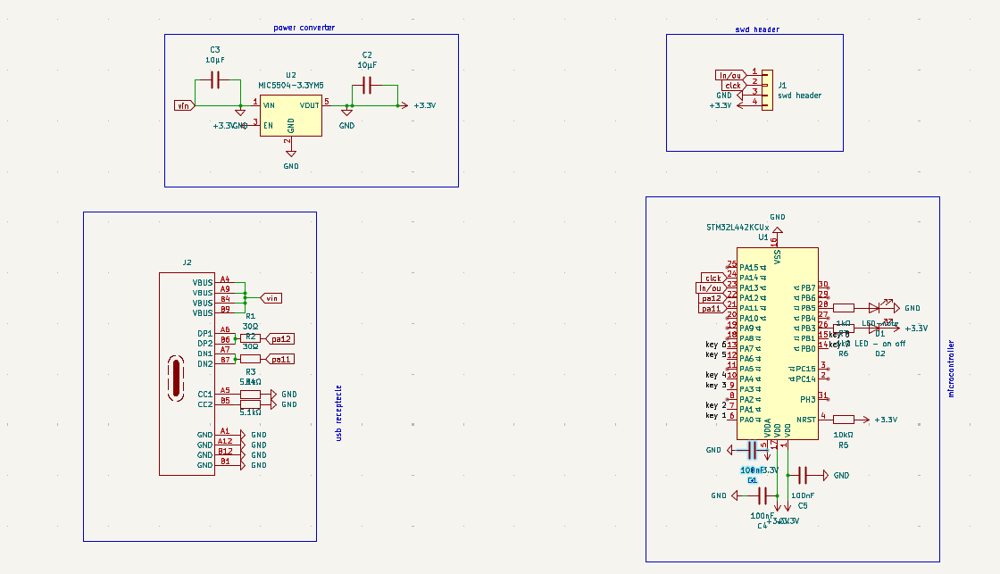
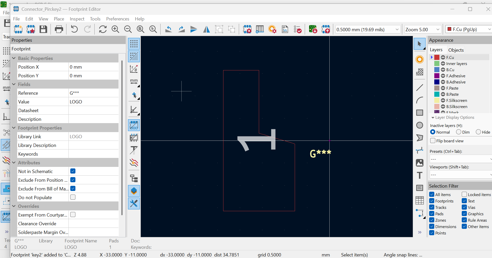
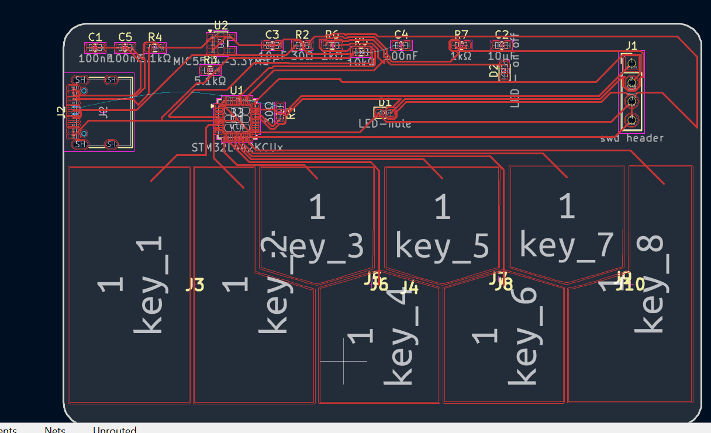

start - 00:04
https://github.com/AnasMalas/pcb-edge-usb-c/tree/main used for the usb c schmatic
currently looking at replacements for CH582M , altthough its the best fit rn , lowk cant find a sinle footprint or symbol for it on ki cad , and none on google either .
NVM IT TOOK LIKE 2 HRS BUT I GOT IT , I USED EASY THING THEN ALTIUM THEN EASY STD AND I GOT IT ON-1:41
nevermind i saved it as a schematic not as a symbol , were changing to STM32L442KC which is almost double the size and harder firmware but avoids the drama-1:57
changed the recepticle to 14 pin just realised the 1 pin didnt have d+ and minus, now connectig , all heds and stuff gonna be 0603-2:24
added a mic5504 to convert power from 5v to 3.3v
also added a 1x4 connecter to act as a swd header.
put the capacitators in parrallel, connect all gnd t gnd, connect dp1 to dp2 etc.  -3:58
10:37 
just added the pcb card layout the size being 85.6x53.98mm, now going to round corners -10:38
lowk just in the cycle of connecting everything , been there for ages - took a break to design keys on canva-1642
currently turning the keys into pads but it doesnt connect for some reason , also took a lil break -2047
spent 2 hrs making sure all the graphics are of a good size and in svg format and dont have an odd bg-2158
FIGURED IT OUT 
TURNING IT INTO A PAD THEN ASSIGNING THE FOOT PRINT TO SCHMATIC THEN IT CONNECTS WOOOO
- ASSIGNING FOOTPRINT.
 added all the keys and , finishing up routing now-23:49
had a couple really anoying routes when i had 4 routes left, spent a bit of time learning about viases , used a bunch of them fixed up the usbc receptecle dn dp ones too

now adding art work-0047