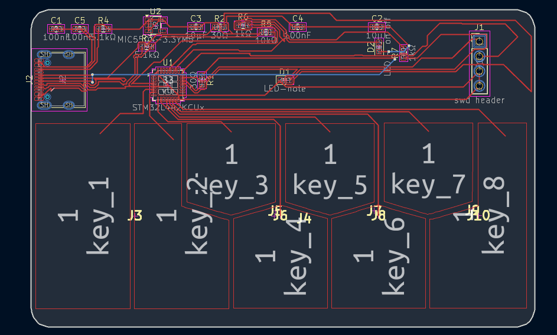
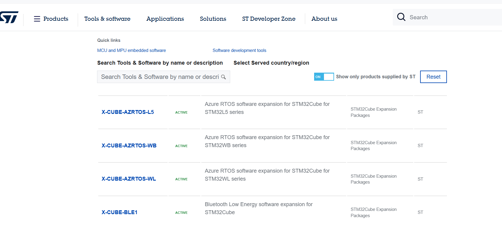

@@ -1,27 +1,4 @@
start - 00:04 -3 hrs 58 mins
https://github.com/AnasMalas/pcb-edge-usb-c/tree/main used for the usb c schmatic
currently looking at replacements for CH582M , altthough its the best fit rn , lowk cant find a sinle footprint or symbol for it on ki cad , and none on google either .
NVM IT TOOK LIKE 2 HRS BUT I GOT IT , I USED EASY THING THEN ALTIUM THEN EASY STD AND I GOT IT ON-1:41
nevermind i saved it as a schematic not as a symbol , were changing to STM32L442KC which is almost double the size and harder firmware but avoids the drama-1:57
changed the recepticle to 14 pin just realised the 1 pin didnt have d+ and minus, now connectig , all heds and stuff gonna be 0603-2:24
added a mic5504 to convert power from 5v to 3.3v
also added a 1x4 connecter to act as a swd header.
put the capacitators in parrallel, connect all gnd t gnd, connect dp1 to dp2 etc.  -3:58

10:37 5 hours ish not too sure
just added the pcb card layout the size being 85.6x53.98mm, now going to round corners -10:38
lowk just in the cycle of connecting everything , been there for ages - took a break to design keys on canva-1642 (-4 hrs)
currently turning the keys into pads but it doesnt connect for some reason , also took a lil break -2047 (-2hrs)
spent 2 hrs making sure all the graphics are of a good size and in svg format and dont have an odd bg-2158
FIGURED IT OUT 
TURNING IT INTO A PAD THEN ASSIGNING THE FOOT PRINT TO SCHMATIC THEN IT CONNECTS WOOOO
- ASSIGNING FOOTPRINT.
 added all the keys and , finishing up routing now-23:49
had a couple really anoying routes when i had 4 routes left, spent a bit of time learning about viases , used a bunch of them fixed up the usbc receptecle dn dp ones too

now adding art work-0047

2hrs 4 mins
that was the 20th of aug , now is 23 ,- 23:46 my wholeproject deleted( well just the pcb after i added silk screens asw :'))
okay anyways im restarting the pcb i hate kicad
 what we at rn , i tried the other edges chauffer or smth i think they look cooler than rounded gonna connect everything now.
 got a bunch on , none left unrouted the holes are gonna bw kinda funky tho but its alrightt.adding graphics now -0122
added stars to the 2 lights plus some more around for decor
-1:31
 TADAAA all done with pcb onto firmware now im thinking of making each key spell my name or smth for now then gonna make a website that uses these latters maybe numbers to play notes!!.-1:50

1hr25 mins
24/08-23:53
HIYAA gonna work on firmware now , just figuring out what software i need -2353
okay so i went off path buttt, i just found out i can use unicode to maybe makesome of my keys emojis so they can double as that WOOOOO . so i can type my name and emojis when im not on my website lmaooo-0022. also just realised it replaced all my pics , crineee. theyre all in the other folder so gonna have to fix that .
also found the app i need to download for the stm32 -STM32CubeMX- i defo used the punctuation wrong but who cares . anyways doenloading that now -0030
fahhh whys there sm like whattt - tm options , just need ide and smth else tho wait im still exploring packages also laptop just switch off amidst me writing that ahhhhhh, everythings against me . -0036 
bro this is cracking meee, as a person who usually just does cad and web dev, i dont like this just got all the fles, the ide and the mx pack from which i can get the l4 serires stuff which is what im using ayyy-1:18

1hr
30/08 23:38
hiiii im alive ummm i signed up for like 30 diff gack club events lets not question it , also went to my first hackathon sunbeam was peak okay back to finish it and make ot yessssss bc i hate cpp and this part of software. that makes no grammatical sense but oh well.-23:40 nvm im too tired ti fix stuff-0038

48 mins
16:46
downloaded the wrong one apparently so i got it on vs codahhaaaa..
all next stuff on the firm ware one ahah-1734

total about = 17.9to 18 hrs
